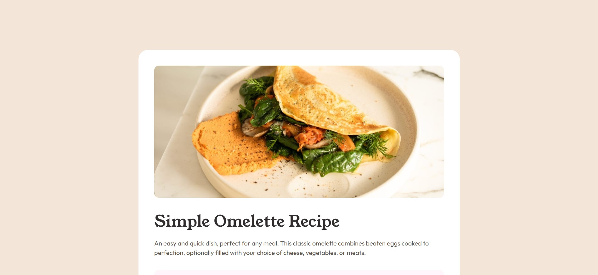

# Frontend Mentor - Recipe page solution

This is a solution to the [Recipe page challenge on Frontend Mentor](https://www.frontendmentor.io/challenges/recipe-page-KiTsR8QQKm). Frontend Mentor challenges help you improve your coding skills by building realistic projects.

## Table of contents

- [Overview](#overview)

- [The challenge](#the-challenge)

- [Screenshot](#screenshot)

- [Links](#links)

- [My process](#my-process)

- [Built with](#built-with)

- [What I learned](#what-i-learned)

- [Continued development](#continued-development)

- [Useful resources](#useful-resources)

- [Author](#author)

## Overview

### Screenshot

### Links

- Solution URL: [https://github.com/milicaaa175/recipe-page](https://github.com/milicaaa175/recipe-page)

- Live Site URL: [https://milicaaa175.github.io/recipe-page/](https://milicaaa175.github.io/recipe-page/)

## My process

### Built with

- Semantic HTML5 markup
- CSS
- Media Queries
- Mobile-first workflow

### What I learned

In this project I learned how to use media queries and how to have a mobile-first workflow. This workflow made building the solution much easier, since I had to adjust only a few things once the mobile styling and layout was done.

### Continued development

I wanted to try and use Bootstrap in this project but I figured this isn't the project to test it on. I want to try and use it but I'm not sure when.

### Useful resources

- [MDN Web Docs](https://developer.mozilla.org/en-US/) - Used for quick search of CSS properties.

- [The Web Developer Bootcamp 2025](https://www.udemy.com/course/the-web-developer-bootcamp/) - I used this to fill in any gaps in my HTML and CSS knowledge. I will continue learning through this course.

## Author

- Frontend Mentor - [@milicaaa175](https://www.frontendmentor.io/profile/milicaaa175)